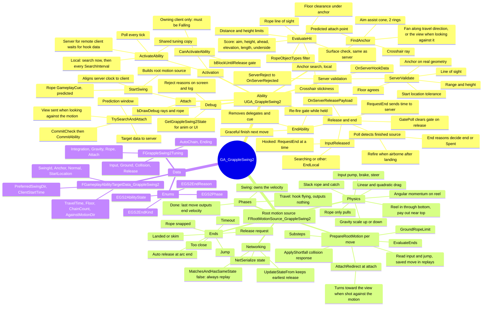
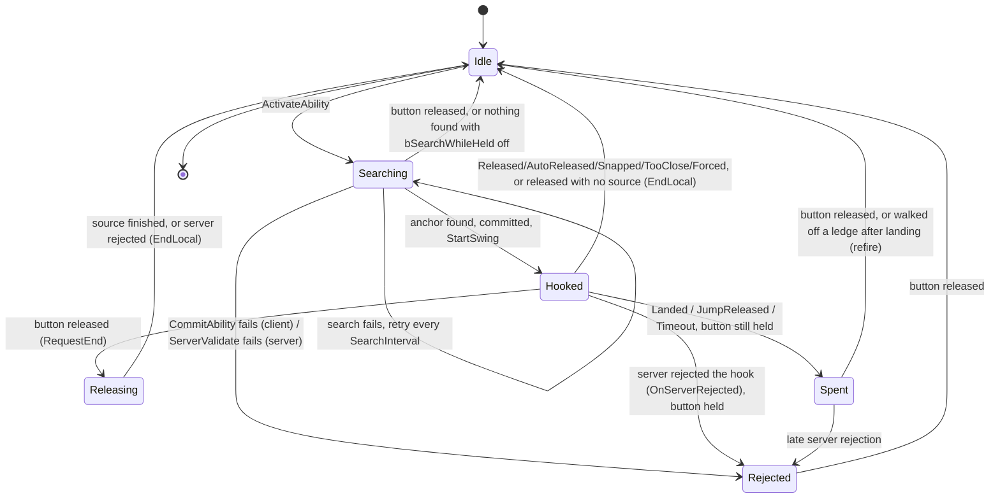
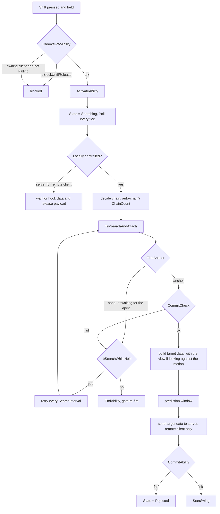
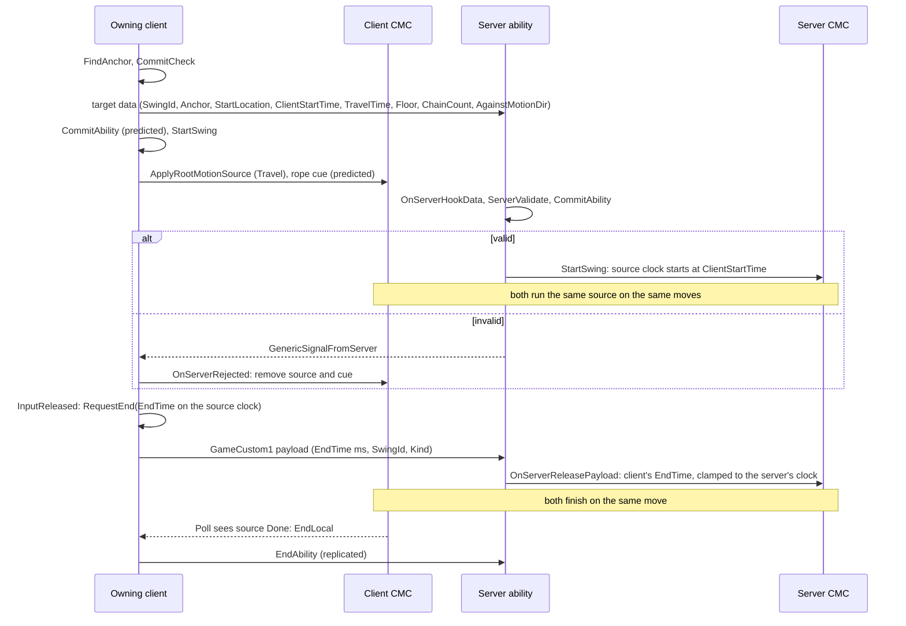
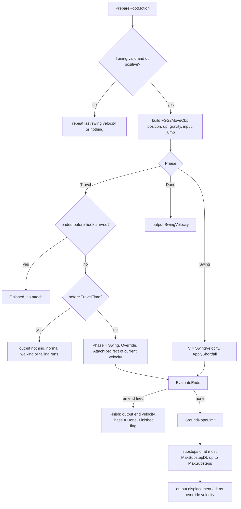

# GA_GrappleSwing2

A Spider-Man style grapple swing, written as a predicted Gameplay Ability plus a custom root motion source. It is the second version: `GA_GrappleSwing` (v1) is left as it was.

- Header: `Source/Aura/Public/AbilitySystem/Abilities/GA_GrappleSwing2.h`
- Source: `Source/Aura/Private/AbilitySystem/Abilities/GA_GrappleSwing2.cpp`
- Blueprint child: `Content/Level/GAS/GameplayAbilities/GA_GrappleSwing/GA_BPGrappleSwing2`, granted through `BP_MyCharMech` StartupAbilities

In one sentence: **press** (in the air) to search for an anchor above and ahead and fire a short hook flight; **hold** to swing on a real pendulum that keeps your momentum; **let go** for a vault that depends on where in the arc you release; **keep holding** to let go automatically at the end of each arc and fire the next web at the apex.

---

## 1. Mind map

---

## 2. The pieces

| Type | What it is | Where it runs |
|---|---|---|
| `UGA_GrappleSwing2` | The ability: input, anchor search, network messages, starting and ending the swing, the rope cue. Instanced per actor, **Local Predicted**. | Owning client and server |
| `FRootMotionSource_GrappleSwing2` | The swing simulation. The CharacterMovementComponent (CMC) runs it every move, so it is predicted, saved, replayed on corrections and checked by the server like normal movement. | Inside the CMC on owning client and server |
| `FGameplayAbilityTargetData_GrappleSwing2` | Everything both machines build the swing from. The owning client sends it once per swing. | Client to server |
| `FGrappleSwing2Tuning` | Every number the simulation reads. The ability hands a shared, read-only copy to each source, so client and server simulate with the same values without sending them. | Both |
| `FGS2MoveCtx` | Per-move context for the simulation (position, up, gravity, input, jump, dt). | Inside `PrepareRootMotion` |
| `FGS2AnchorCandidate`, `FGS2SearchCtx` | Search result and search inputs. | Owning client |

Native tags defined in the .cpp (the C++ symbol names differ from v1's so both files can share a unity build; the rope cue tag string is the same one v1 uses):
- `Ability.GrappleSwing2` (the AbilityTag)
- `GameplayCue.GrappleRope` (the default `RopeCueTag`)

---

## 3. Ability state machine

`EGS2AbilityState` values: `Idle`, `Searching`, `Hooked`, `Releasing`, `Spent`, `Rejected`.

- **Hooked** covers both the hook flight and the swing; the source's own `Phase` (Travel, Swing, Done) tells them apart.
- **Spent** keeps the ability alive with no rope, so a held button does not re-fire every frame after a landing or a jump-release.
- **Rejected** does the same after a failed commit or a server rejection. On the owning client a rejection usually lands while **Hooked**, because the client started its swing before the server answered; `OnServerRejected` removes the source and the cue, and the predicted cooldown rolls back with its prediction key.
- On the server for a remote client, the ability goes to **Spent** when the source finishes and waits for the client's end.
- Any state can also go straight to **Idle** through an external `EndAbility` (cancel by tag, death, server cancel). If the button is still held then, the re-fire gate (`bBlockUntilRelease`) blocks activation until it goes up.

---

## 4. Main flow

### 4.1 Activation and search (owning client)

### 4.2 Anchor search (`FindAnchor` + `EvaluateHit`)

1. Read the view point from the PlayerController and the character's velocity and gravity.
2. If this is an **auto-chain** activation, wait until rising speed drops below `ChainAttachMaxRiseSpeed` (the apex).
3. Predict where the character will be when the hook arrives (`AttachPos`) using a travel guess from `IdealRopeLength / HookSpeed`.
4. Cast rays on `GrappleTraceChannel` (default Visibility), up to `MaxGrappleDistance`:
   - **Crosshair**: from the view, starting level with the character.
   - **Aim assist cone**: two rings (half and full `AimAssistConeDeg`) of `AssistRaysPerRing` rays, pitched up by `AimAssistUpBiasDeg`.
   - **Fan**: from `AttachPos`, yaw `-SwingFanYawDeg, 0, +SwingFanYawDeg` times each elevation in `SwingFanElevationsDeg` (35, 50, 65), around the horizontal travel direction (the camera's horizontal direction when moving 400 cm/s or slower, or when looking more than 90° away from the motion).
   - The search rays trace complex collision; the rope traces (here, during the swing and on the server) use simple collision filtered by `RopeObjectTypes`. That difference is why the surface check below exists.
5. Each hit goes through `EvaluateHit`, which rejects it when:
   - the hit component's object type is not in `RopeObjectTypes` (default WorldStatic and WorldDynamic);
   - it hit a Pawn;
   - distance from `AttachPos` is outside `[MinRopeLength + 100, MaxGrappleDistance]`;
   - it is less than `MinAnchorHeight` above `AttachPos`;
   - the rope line from the capsule to the anchor is blocked;
   - there is no surface under the anchor along its normal (the same check the server does);
   - the floor under the anchor is too close for the arc to fit: the anchor has to be at least `MinRopeLength + HalfHeight + GroundClearance` above it (608 with an 88 cm capsule half height).
6. Survivors are scored: aim (0 for fan rays), height, ahead along the same direction as the fan, elevation near `IdealElevationDeg`, rope length near `IdealRopeLength`, underside surfaces (1 for a ceiling, -1 for a floor, 0.5 for walls and slopes), each times its `ScoreWeight*`, plus `CrosshairBonus` for the crosshair hit.
7. The best one wins, except the crosshair anchor wins if it is within `CrosshairStickiness` of the best.

### 4.3 Network sequence (remote client)

Key points:
- The hook data is sent **once**. Both machines build the source only from it plus the shared tuning.
- The server starts its source clock at the client's move time stamp (`ClientStartTime`), corrected for a time stamp reset, so the attach and the release happen on the **same move** on both machines.
- The release is not "stop now", it is "stop at source time T", sent reliably before the next ServerMove. The server ignores a payload for another `SwingId`, clamps T to between its own source time and `MaxReleaseLead` after it, and keeps a drop during the hook flight before `TravelTime`. So both machines end on the same move when the payload arrives before the server's source passes T. The earliest valid request wins on both sides.
- `ServerValidate` also rejects a repeated `SwingId` and NaN vectors, measures range and height from `StartLocation` with an allowance for the longest hook flight, and the server clamps `TravelTime` and `ChainCount` and caps its start time at `MaxStartLead` ahead.
- Simulated proxies just follow replicated movement; the rope they see is the looping GameplayCue.

### 4.4 One move of the root motion source (`PrepareRootMotion`)

**Attach (`AttachRedirect`)**: the only time the source reads the CMC's velocity.
- Rope length starts at the distance to the anchor (at least `MinRopeLength`).
- Flying up at the anchor faster than `AttachSlackInwardSpeed` starts the rope **slack**.
- Otherwise the tangential speed is kept plus part of the radial energy (`AttachOutwardRetention` / `AttachInwardRetention`), aimed between the current motion and the preferred direction (`AttachAimBias`), at least `AttachMinSwingSpeed`.
- **Fired while looking against the motion** (`AgainstMotionDir`, the horizontal view direction, sent in the target data): the web stops the speed heading away from the view (a drift slower than `AgainstMotionFullStopSpeed` only partly). A taut start turns `AgainstMotionSpeedScale` of that speed along the view, and keeps the old start's speed when the old start already went that way. Rising at the anchor with the arc still starting clearly away from the view, the rope starts slack instead. The start is never faster than it would be without the turn.
- Chained swings multiply the attach velocity by `1 + stacks × ChainSpeedBonus` (+5% per stack), up to `MaxChainStacks`.
- On the ground it raises the upward speed to at least `GroundLiftoffSpeed` (sensitive lift-off then makes the character fall).

**Each substep (`Substep`)**:
1. **Rope length**: reel in through the bottom of the arc (`PumpReelInSpeed`, down to `MinRopeFraction` of the start length), pay out near the top (`PumpPayOutSpeed`), and always shorten to clear the ground (`GroundReelSpeed`).
2. **Forces**: gravity scaled heavier falling than rising, linear plus quadratic drag (soft speed cap at `SoftMaxSpeed`), input pump or brake while taut, air control and hook pull while slack.
3. **Steer**: sideways input rotates the swing plane around the rope (`SteerTurnRateDeg`), adding no energy.
4. **Tension**: the rope can only pull, never push. While taut, the outward part of the velocity is cancelled before the move; that is the tension balancing gravity's pull along the rope.
5. **Drift and constraint**: move, then snap back onto the rope length. Velocity that would stretch the rope is turned onto the new tangent with its speed kept (the centripetal turn, which is the centrifugal force the rope holds). Reeling in speeds up the swing (angular momentum, `ReelMomentumGain`).
6. **Slack**: moving inward faster than the rope makes it slack; slack beyond `SlackAllowance` is taken up at `SlackTakeUpSpeed`. A slack rope that goes taut again redirects part of the impact into the swing (`CatchEnergyRetention`).
7. **Clamp**: speed never exceeds `HardMaxSpeed`.

**Collision (`ApplyShortfall`)**: compares where the last move should have ended with where it did. If it fell short, the into-surface velocity is removed and a little friction is applied.

### 4.5 How a swing ends

`EvaluateEnds` checks once per move, in this order:

| Order | Reason | Condition | Velocity out |
|---|---|---|---|
| a | `Released` / `Forced` | `EndTime` reached (button up or ability ended) | Release vault, or unchanged if forced |
| b | `JumpReleased` | Jump pressed (`bJumpReleases`), after `MinSwingTimeAfterAttach` | Release vault |
| c | `Timeout` | Swinging longer than `MaxSwingDuration` | Unchanged |
| d | `TooClose` | Closer than half `MinRopeLength` to the anchor | Unchanged |
| e | `Snapped` | Rope blocked by geometry longer than `LOSBreakTime` | Unchanged |
| f | `Landed` | On the ground, slow or slack, after `LandingGraceTime` (fast and taut skims instead) | Horizontal, capped at `LandingMaxCarrySpeed` |
| g | `AutoReleased` | `bAutoReleaseAtArcEnd`, after `AutoReleaseMinSwingTime`, taut, rising and moving away from under the anchor, and either past `AutoReleaseAngleDeg` or slowed to `max(AutoReleaseStallSpeed, AutoReleasePeakFraction × peak speed)` | Vault times `AutoReleaseBonusScale` |

**Release vault (`ReleaseVelocity`)**: adds `ReleaseUpBoostMin` (released at the bottom or falling) up to `ReleaseUpBoostMax` plus `ReleaseForwardBoost` (released while rising steeply, full at `ReleaseVaultDot`), capped at `ReleaseMaxSpeed` or the current speed if that is higher. A slack rope gives no vault.

**How the end velocity sticks**: `Finish` outputs the end velocity as the override on that last move and sets the Finished flag. The CMC then removes the source with `MaintainLastRootMotionVelocity`, so the character carries that velocity into normal falling or walking.

**A tap still swings**: letting go during the hook flight asks for the end at `TravelTime + MinSwingTimeAfterAttach` at the earliest, so the hook attaches and gives a short swing.

What the ability does next (`Poll`, owning client):
- `Released`, `Forced`: the button is already up, so the ability ends.
- `AutoReleased`, `Snapped`, `TooClose`: the ability ends, and the held button re-fires next frame. That is the hold-to-cruise chain.
- `Landed`, `JumpReleased`, `Timeout`: if the button is already up, the ability ends. If it is still held, the ability goes to **Spent** (no re-fire). After a landing, walking off a ledge for `RefireAirborneDelay` while still holding ends it so it can fire again (`bRefireWhenAirborne`).

If the source never shows up, `Poll` waits `SourceAppearTimeout` (1 s) before treating it as gone; a source that vanished without reporting a reason counts as `Landed` on the ground and `Snapped` in the air.

**Chaining**: a new activation within `ChainWindow` of a `Released`, `AutoReleased` or `JumpReleased` detach gets one more chain stack (capped at `MaxChainStacks`); any other end resets it. Only after an `AutoReleased` detach does the next web wait for the apex (`ChainAttachMaxRiseSpeed`).

**Ending mid-flight**: if the ability ends while the hook is still flying (cancel, death), the source finishes without ever attaching, reports `Forced` and leaves the velocity alone.

**EndAbility**: never removes the source directly (client and server would remove it on different moves). It asks for a graceful finish on the next move (`Forced`, keeping the velocity, when the end is a cancel; otherwise `Released`, with the vault), removes the delegates, removes the rope cue and arms the re-fire gate (`bBlockUntilRelease` + `GatePoll`) if the ability was ended from outside while the button is still held.

---

## 5. Networking summary

| Concern | How it is handled |
|---|---|
| Same simulation on both machines | Source built only from target data plus shared tuning; input and jump read from the replayed saved move during client replays |
| Same attach and release move | Server source clock starts at `ClientStartTime`; release sent as a source time (`GameCustom1` payload) |
| Corrections | `MatchesAndHasSameState` returns false, so a correction always replays from the server's state; `UpdateStateFrom` copies the state and keeps the earliest release; `Matches` ignores `AccumulateMode`, which switches from Additive to Override at attach |
| Cheating or bad data | `ServerValidate`: start location near the server's, range, height, line of sight, anchor on real geometry, floor agrees, no NaN; rejection via `GenericSignalFromServer`. `AgainstMotionDir` is flattened and normalized on both machines, and in the air the turned attach is never faster than the plain one |
| Rope visual | Looping GameplayCue, predicted on the owner, replicated through the ASC owner (`ForceNetUpdate` on add and remove) |
| Late hook data | Server aligns its clock within the hook flight; an `EndAbility` during the flight stays a drop on the server too, never an attach and immediate finish |

---

## 6. Tuning reference

All in Class Defaults of `GA_BPGrappleSwing2`.

**Grapple | Hook**: `MaxGrappleDistance` 4000, `GrappleTraceChannel` Visibility, `MinAnchorHeight` 250, `IdealAnchorHeight` 900, `MaxIdealAnchorHeight` 2200, `IdealElevationDeg` 50, `IdealRopeLength` 1300, `AnchorSurfaceOffset` 8, `AimAssistConeDeg` 14, `AimAssistUpBiasDeg` 6, `AssistRaysPerRing` 6, `SwingFanYawDeg` 25, `SwingFanElevationsDeg` {35, 50, 65}, `ScoreWeightAim` 1, `ScoreWeightHeight` 0.6, `ScoreWeightAhead` 0.8, `ScoreWeightElevation` 0.6, `ScoreWeightLength` 0.4, `ScoreWeightUnderside` 0.3, `CrosshairBonus` 0.5, `CrosshairStickiness` 0.15, `SearchInterval` 0.05, `bSearchWhileHeld` true, `ChainAttachMaxRiseSpeed` 250, `ChainWindow` 0.6.

**Grapple | Travel**: `HookSpeed` 15000, `MinHookTravelTime` 0.06, `MaxHookTravelTime` 0.16.

**Grapple | Flow**: `bRefireWhenAirborne` true, `RefireAirborneDelay` 0.15, `GatePollInterval` 0.05.

**Grapple | Network**: `ServerStartTolBase` 200, `ServerStartTolSpeedTime` 0.25, `ServerRangeTolerance` 300, `ServerFloorTolerance` 25, `ServerLOSAnchorSlack` 30, `MaxStartLead` 1, `MaxReleaseLead` 1, `RootMotionPriority` 500.

**Grapple | Visuals**: `RopeCueTag` GameplayCue.GrappleRope, `bDrawDebug` false.

**Grapple | Swing** (`FGrappleSwing2Tuning`):

| Group | Values |
|---|---|
| Integration | `MaxSubstepDt` 1/120, `MaxSubsteps` 16 |
| Gravity | `GravityScaleDescending` 2, `GravityScaleAscending` 1.3, `GravityBlendSpeed` 100, `LinearDrag` 0.02, `SoftMaxSpeed` 3000, `DragAtSoftMaxSpeed` 500, `HardMaxSpeed` 5000 |
| Rope | `MinRopeLength` 400, `MinRopeFraction` 0.65, `TautTolerance` 0.5, `PumpReelInSpeed` 130, `PumpPayOutSpeed` 100, `PumpFullSpeed` 1500, `ReelMomentumGain` 0.8, `SlackHookPull` 300, `SlackAirControlAccel` 350, `SlackAllowance` 120, `SlackTakeUpSpeed` 700, `CatchEnergyRetention` 0.55 |
| Attach | `AttachOutwardRetention` 0.85, `AttachInwardRetention` 0.7, `AttachMinSwingSpeed` 900, `AttachAimBias` 0.25, `AgainstMotionSpeedScale` 0.4, `AgainstMotionFullStopSpeed` 1000, `AttachSlackInwardSpeed` 700, `ChainSpeedBonus` 0.05, `MaxChainStacks` 3 |
| Input | `InputAuthority` 1, `SteerTurnRateDeg` 75, `MaxSteerLateralAccel` 1500, `PumpAccel` 380, `PumpMaxSpeed` 2600, `BrakeAccel` 300, `LowSpeedThreshold` 250, `LowSpeedInputAccel` 550 |
| Ground | `GroundClearance` 120, `GroundReelSpeed` 2400, `GroundReelTime` 0.12, `bGroundProbe` true, `ProbeLookAheadTime` 0.3, `ProbeMargin` 50, `ProbeMinFloorDot` 0.6, `GroundLiftoffSpeed` 450, `SkimMinSpeed` 700, `LandingGraceTime` 0.25, `LandingMaxCarrySpeed` 1100 |
| Collision | `BlockTolMin` 0.5, `BlockTolFull` 2, `ContactFriction` 0.2 |
| Release | `MinSwingTimeAfterAttach` 0.12, `ReleaseUpBoostMin` 120, `ReleaseUpBoostMax` 500, `ReleaseForwardBoost` 300, `ReleaseVaultDot` 0.7, `ReleaseMaxSpeed` 4000, `bJumpReleases` true |
| AutoChain | `bAutoReleaseAtArcEnd` true, `AutoReleaseAngleDeg` 50, `AutoReleasePeakFraction` 0.55, `AutoReleaseStallSpeed` 350, `AutoReleaseMinSwingTime` 0.35, `AutoReleaseBonusScale` 0.6 |
| Ending | `LOSBreakTime` 0.12, `AnchorLOSInset` 20, `RopeAttachHeightFrac` 0.5, `MaxSwingDuration` 20, `RopeObjectTypes` {WorldStatic, WorldDynamic} |

---

## 7. Blueprint setup

1. `GA_BPGrappleSwing2` (child of `GA_GrappleSwing2`): set `InputTag` (currently `Input.Shift`).
2. Add it to the character's StartupAbilities (`BP_MyCharMech`).
3. Make a looping GameplayCue notify for `GameplayCue.GrappleRope`: Location = anchor, Normal = anchor surface normal, RawMagnitude = hook flight time, EffectCauser and Instigator = the swinging character.
4. Suggested: add a "grappling" tag to ActivationOwnedTags and block or cancel `GA_JumpHover` while swinging, since hover changes the movement mode without prediction.

Shift is shared with `GA_Boost`. Boost's `CanActivateAbility` refuses while Falling and the swing's only accepts while Falling, so one press only ever starts one of them.

---

## 8. Debugging

- Tick **`bDrawDebug`** (Grapple | Visuals):
  - Search rays: green = valid anchor, red = rejected hit, grey = hit nothing.
  - The first full search of each activation (hold-to-cruise re-fires included) prints its reject reasons, with the numbers, to the screen and to the log category `LogGrappleSwing2`. While an auto-chain waits for the apex, that message repeats each retry.
  - An anchor that was found but failed `CommitCheck` (cost or cooldown) says so on every retry, on screen and in the log.
  - While swinging: the rope line (white taut, yellow slack), the anchor sphere, rope length and speed.
- `UGA_GrappleSwing2::GetGrappleSwing2State(Character, Anchor, RopeLength, bTaut)` is BlueprintPure, for animation or UI. It returns true only once the hook has attached (Swing phase), so the debug rope also starts at the attach.
- `FRootMotionSource_GrappleSwing2::ToSimpleString` shows up in root motion debug output (`p.RootMotion.Debug 1`).

---

## 9. Known limits

- Moving geometry: the rope traces run on both machines on every move. Anything in `RopeObjectTypes` that moves can make client and server disagree and cause corrections. The hex platforms are included (WorldDynamic) because they keep the default `BlockAllDynamic` profile; keep moving pieces on another object type.
- The anchor is a fixed point in the world. If the tile it hooked collapses or moves away, the rope stays attached to the empty spot until the swing ends some other way.
- The airborne check runs only on the owning client, on purpose: the server can be a move behind the client's jump.
- Holding Shift on the ground and then jumping fires the grapple as soon as the character leaves the ground, because a held input retries activation every frame.
- The ability copies `Swing` (the tuning) into a shared read-only snapshot on its first activation and reuses it, so tuning changes made at runtime on a live instance are not picked up. Class Defaults edits are fine.
- Simulated proxies do not run the swing simulation; they show the replicated movement and the rope cue.
- The search needs a PlayerController, so an AI-controlled character never finds an anchor.
- Fired while looking against the motion, a short press while rising fast backward at a low hook can pull less than a plain attach, and a tap during a slow backward drift keeps some of that drift.
- Not yet play-tested in a real client/server session (only in the editor). The look-against-the-motion attach is checked only in simulation so far.
